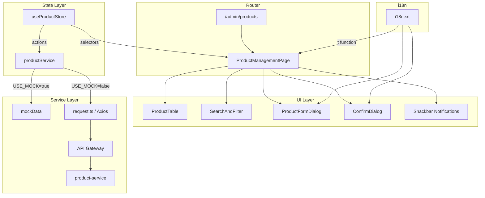

# Design Document: Admin Product Management

## Overview

本設計文件描述 AWSome Shop 管理端商品管理功能的技術架構。此功能為管理員提供完整的商品 CRUD 介面，位於 `/admin/products` 路由下，使用 MUI DataTable 元件配合分頁、搜尋與篩選功能。

設計遵循現有專案慣例：
- 頁面目錄結構：`src/pages/Products/index.tsx`
- 服務層抽象：`src/services/productService.ts`
- Zustand 狀態管理：`src/store/useProductStore.ts`
- i18n 翻譯：擴展現有 `zh.json` / `en.json`
- MUI sx prop 行內樣式（無 CSS 檔案）

初期使用 Mock 資料，服務層設計為可無縫切換至後端 API（透過 API Gateway → product-service）。

## Architecture



### 設計決策

| 決策 | 選擇 | 理由 |
|------|------|------|
| 狀態管理 | Zustand store (useProductStore) | 遵循現有 useAuthStore/useAppStore 模式，支援 persist |
| 表格元件 | MUI Table + 自行實作分頁/篩選 | 專案已用 MUI Table，避免引入新依賴 |
| 對話框表單 | MUI Dialog + 受控表單 | 遵循 MUI 慣例，支援驗證 |
| Mock 切換 | 服務層內部 flag | 最小化切換成本，僅需改一行 |
| 通知機制 | MUI Snackbar | 輕量且與 MUI 生態一致 |

## Components and Interfaces

### 頁面元件

```typescript
// src/pages/Products/index.tsx
export default function ProductManagementPage(): JSX.Element
```

主要職責：
- 容器元件，組裝所有子元件
- 從 useProductStore 讀取狀態
- 管理對話框開關狀態（新增/編輯/刪除確認）
- 處理 Snackbar 通知邏輯

### 子元件

```typescript
// 搜尋與篩選列
interface SearchAndFilterProps {
  searchValue: string;
  onSearchChange: (value: string) => void;
  category: string;
  onCategoryChange: (value: string) => void;
  status: string;
  onStatusChange: (value: string) => void;
  categories: Category[];
}

// 商品表格
interface ProductTableProps {
  products: Product[];
  page: number;
  rowsPerPage: number;
  totalCount: number;
  loading: boolean;
  onPageChange: (page: number) => void;
  onRowsPerPageChange: (rowsPerPage: number) => void;
  onEdit: (product: Product) => void;
  onDelete: (product: Product) => void;
  onToggleStatus: (product: Product) => void;
}

// 商品表單對話框
interface ProductFormDialogProps {
  open: boolean;
  product: Product | null; // null = 新增模式
  onClose: () => void;
  onSubmit: (data: ProductFormData) => void;
  loading: boolean;
}

// 確認對話框
interface ConfirmDialogProps {
  open: boolean;
  title: string;
  message: string;
  onConfirm: () => void;
  onCancel: () => void;
  loading: boolean;
}
```

### 服務層介面

```typescript
// src/services/productService.ts

interface ProductService {
  getProducts(params: GetProductsParams): Promise<PaginatedResponse<Product>>;
  createProduct(data: CreateProductDto): Promise<Product>;
  updateProduct(id: string, data: UpdateProductDto): Promise<Product>;
  deleteProduct(id: string): Promise<void>;
  toggleProductStatus(id: string): Promise<Product>;
}

interface GetProductsParams {
  page: number;
  pageSize: number;
  search?: string;
  category?: string;
  status?: ProductStatus;
}

interface PaginatedResponse<T> {
  data: T[];
  total: number;
  page: number;
  pageSize: number;
}
```

### Store 介面

```typescript
// src/store/useProductStore.ts

interface ProductState {
  // Data
  products: Product[];
  total: number;
  loading: boolean;
  error: string | null;

  // Filters
  page: number;
  pageSize: number;
  search: string;
  categoryFilter: string;
  statusFilter: string;

  // Actions
  fetchProducts: () => Promise<void>;
  createProduct: (data: CreateProductDto) => Promise<boolean>;
  updateProduct: (id: string, data: UpdateProductDto) => Promise<boolean>;
  deleteProduct: (id: string) => Promise<boolean>;
  toggleStatus: (id: string) => Promise<boolean>;
  setPage: (page: number) => void;
  setPageSize: (size: number) => void;
  setSearch: (search: string) => void;
  setCategoryFilter: (category: string) => void;
  setStatusFilter: (status: string) => void;
}
```

## Data Models

### Product Entity

```typescript
interface Product {
  id: string;
  name: string;
  category: string;
  description: string;
  pointsPrice: number;
  imageUrl: string;
  stock: number;
  status: ProductStatus;
  createdAt: string;
  updatedAt: string;
}

type ProductStatus = 'active' | 'inactive';

interface Category {
  key: string;
  label: string;
}
```

### Form Data

```typescript
interface ProductFormData {
  name: string;
  category: string;
  description: string;
  pointsPrice: number;
  imageUrl: string;
  stock: number;
}

type CreateProductDto = ProductFormData;

interface UpdateProductDto extends Partial<ProductFormData> {}
```

### Validation Rules

```typescript
interface ValidationResult {
  valid: boolean;
  errors: Record<string, string>;
}

// 驗證規則:
// - name: 不為空（trim 後）
// - pointsPrice: 正整數 (> 0)
// - category: 不為空
// - stock: 非負整數 (>= 0)
```

### Mock 資料結構

```typescript
const MOCK_CATEGORIES: Category[] = [
  { key: 'electronics', label: '電子產品' },
  { key: 'food', label: '食品飲料' },
  { key: 'lifestyle', label: '生活用品' },
  { key: 'voucher', label: '禮品卡券' },
];

// Mock 商品資料: 20-30 筆，覆蓋各分類及狀態
```

### API 端點對照（未來整合）

| 操作 | Method | Path |
|------|--------|------|
| 列表查詢 | GET | `/product-service/products` |
| 新增商品 | POST | `/product-service/products` |
| 更新商品 | PUT | `/product-service/products/:id` |
| 刪除商品 | DELETE | `/product-service/products/:id` |
| 切換狀態 | PATCH | `/product-service/products/:id/status` |


## Correctness Properties

*A property is a characteristic or behavior that should hold true across all valid executions of a system—essentially, a formal statement about what the system should do. Properties serve as the bridge between human-readable specifications and machine-verifiable correctness guarantees.*

### Property 1: Combined filter correctness

*For any* product list, and any combination of search term, category filter, and status filter, the filtered result set SHALL contain only products that satisfy ALL active filter conditions simultaneously (name contains search term case-insensitively AND category matches selected category AND status matches selected status), and SHALL NOT exclude any product that satisfies all active conditions.

**Validates: Requirements 2.2, 2.4, 2.6, 2.7**

### Property 2: Form validation rejects invalid inputs

*For any* string composed entirely of whitespace characters (including empty string), the name validator SHALL reject it; and *for any* number that is not a positive integer (zero, negative, decimal, NaN), the points price validator SHALL reject it; and *for any* non-empty trimmed name string and any positive integer price, the respective validators SHALL accept them.

**Validates: Requirements 3.3, 3.4**

### Property 3: Edit form data integrity

*For any* product in the product list, when the edit form is opened for that product, the form fields SHALL be pre-filled with values exactly matching the product's current name, category, description, pointsPrice, imageUrl, and stock values.

**Validates: Requirements 4.2**

### Property 4: Delete confirmation shows product identity

*For any* product in the product list, when the delete action is triggered for that product, the confirmation dialog SHALL display a message containing the product's name.

**Validates: Requirements 5.3**

### Property 5: Deletion removes product from list

*For any* product list of size N and any product P in that list, after successfully deleting P, the resulting list SHALL have size N-1 and SHALL NOT contain a product with P's id.

**Validates: Requirements 5.4**

### Property 6: Status toggle is an involution

*For any* product with status S, toggling its status SHALL produce the opposite status (active → inactive, inactive → active). Furthermore, toggling twice SHALL restore the original status S.

**Validates: Requirements 6.1, 6.3**

### Property 7: Mock service response structure conformance

*For any* valid GetProductsParams (varying page, pageSize, search, category, status), the mock service SHALL return a PaginatedResponse object with: data as an array of Product objects each containing all required fields (id, name, category, description, pointsPrice, imageUrl, stock, status, createdAt, updatedAt), total as a non-negative integer, and page/pageSize matching the request params.

**Validates: Requirements 8.3**

## Error Handling

### 錯誤類型與處理策略

| 錯誤場景 | 處理方式 | UI 回饋 |
|----------|----------|---------|
| 載入商品列表失敗 | 顯示錯誤狀態，提供重試按鈕 | Alert 元件顯示錯誤訊息 |
| 新增/編輯/刪除失敗 | 關閉對話框，顯示錯誤通知 | Snackbar 顯示錯誤訊息（severity: error） |
| 狀態切換失敗 | 樂觀更新回滾，顯示錯誤通知 | Snackbar 顯示錯誤 + 狀態恢復原值 |
| 表單驗證失敗 | 阻止提交，顯示欄位級錯誤 | TextField 顯示 helperText 紅色提示 |
| 網路超時 | 與 API 失敗相同處理 | Snackbar 顯示逾時訊息 |

### 樂觀更新策略（狀態切換）

```typescript
// 1. 立即更新 UI 狀態
// 2. 發送 API 請求
// 3. 若失敗：回滾狀態 + 顯示錯誤通知
```

### 錯誤訊息國際化

所有錯誤訊息通過 i18next 翻譯鍵管理，確保中英文切換時錯誤提示也同步更新。

## Testing Strategy

### 測試框架選擇

| 工具 | 用途 |
|------|------|
| Vitest | 單元測試執行器（與 Vite 整合） |
| @testing-library/react | React 元件測試 |
| fast-check | 屬性基礎測試（Property-Based Testing） |
| msw (Mock Service Worker) | API Mock（可選，用於整合測試） |

### 雙軌測試策略

**單元測試（Example-Based）：**
- 元件渲染測試（表格、表單、對話框）
- 使用者互動流程（新增→成功、編輯→成功、刪除→確認→成功）
- 錯誤場景（API 失敗、驗證失敗）
- i18n 語言切換

**屬性測試（Property-Based）：**
- 使用 fast-check 庫
- 每個屬性測試至少 100 次迭代
- 每個測試標注對應設計文件屬性
- 標注格式：**Feature: admin-product-management, Property {number}: {property_text}**

### 屬性測試實作要點

```typescript
import * as fc from 'fast-check';

// Property 1: Combined filter correctness
// Feature: admin-product-management, Property 1: Combined filter correctness
test('filtered results satisfy all active conditions', () => {
  fc.assert(
    fc.property(
      fc.array(productArbitrary),        // 隨機商品列表
      fc.string(),                        // 隨機搜尋詞
      fc.constantFrom('', ...categories), // 隨機分類
      fc.constantFrom('', 'active', 'inactive'), // 隨機狀態
      (products, search, category, status) => {
        const result = filterProducts(products, { search, category, status });
        // 驗證所有結果符合所有篩選條件
        // 驗證沒有遺漏符合條件的商品
      }
    ),
    { numRuns: 100 }
  );
});
```

### 測試目錄結構

```
src/
├── pages/Products/
│   └── __tests__/
│       ├── ProductManagementPage.test.tsx   # 整合/渲染測試
│       ├── ProductTable.test.tsx            # 表格元件測試
│       └── ProductFormDialog.test.tsx       # 表單元件測試
├── services/
│   └── __tests__/
│       └── productService.test.ts          # 服務層測試
└── utils/
    └── __tests__/
        └── productFilters.property.test.ts # 屬性測試
        └── productValidation.property.test.ts # 驗證屬性測試
```

### 覆蓋率目標

- 服務層（productService）：≥ 90%
- 純函式（filter、validation）：100%（含屬性測試）
- UI 元件：≥ 80%（關鍵互動路徑）
