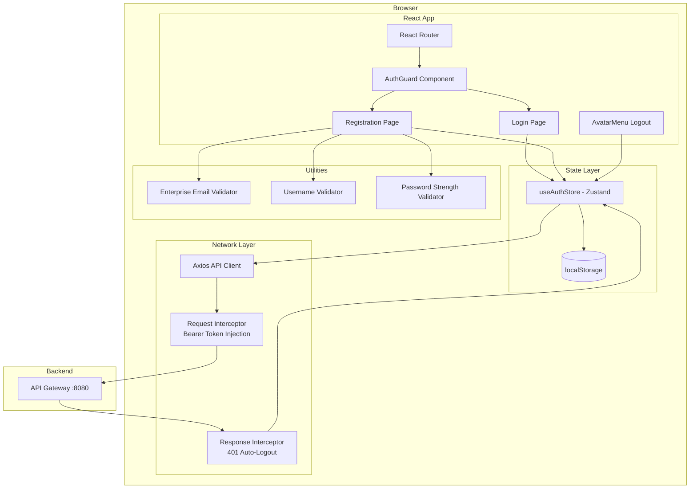
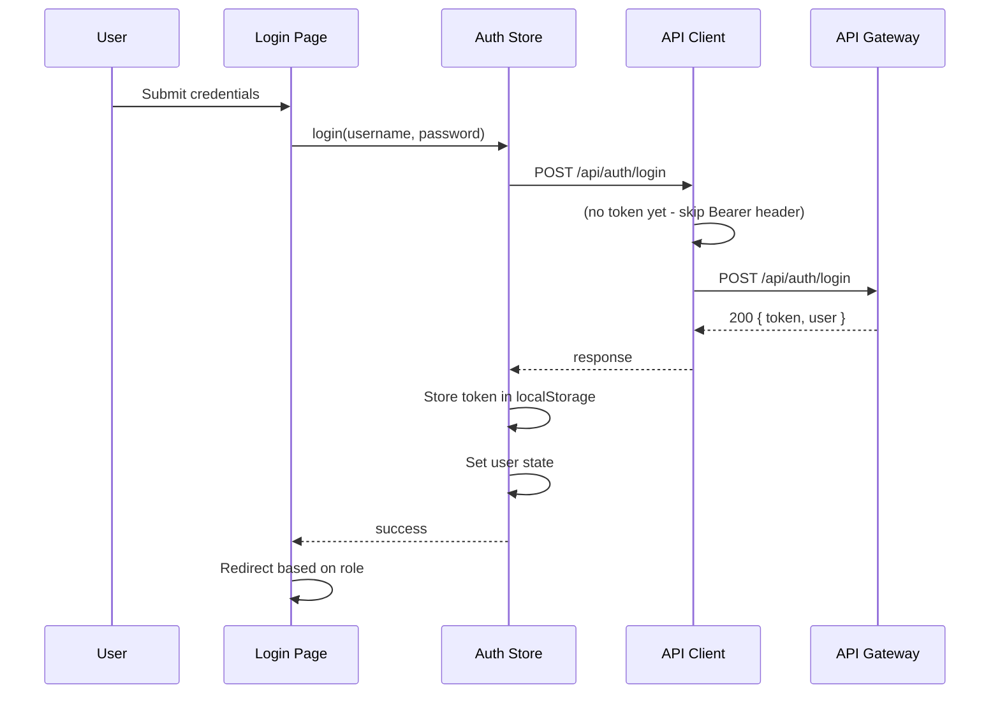

# Design Document: Employee Authentication

## Overview

This design describes the frontend architecture for the Employee Authentication feature in the AWSome Shop SPA. The feature transforms the existing mock-based authentication into a real JWT-based system, adds a self-registration page with enterprise email and password validation, enhances the auth guard with token verification and loading states, and introduces a centralized API client with interceptors.

The design builds on existing infrastructure — the Login page skeleton, Zustand auth store, AuthGuard component, i18n setup, and router configuration — and extends them to support real backend communication through the API Gateway at port 8080.

### Key Design Decisions

1. **Centralized API client via axios instance** — a single configured axios instance with request/response interceptors handles Bearer token injection and 401 auto-logout, eliminating repetitive auth logic across components.
2. **Auth store retains mock mode** — a `USE_MOCK` flag (driven by `VITE_USE_MOCK` env var) allows the store to function with mock data during development while supporting real API calls in production.
3. **Token verification on app load** — the AuthGuard performs async token validation on mount, displaying a loading state to prevent login page flash.
4. **Pure validation utilities** — email, username, and password validators are pure functions in a shared `utils/validation.ts` module, enabling property-based testing without UI coupling.
5. **Registration as a new route** — `/register` is a public route alongside `/login`, with client-side navigation between them.

## Architecture



### Request Flow



## Components and Interfaces

### 1. API Client (`src/api/client.ts`)

A configured axios instance serving as the single HTTP entry point.

```typescript
// Creates an axios instance with baseURL pointing to API Gateway
// Request interceptor: reads token from localStorage, injects Authorization: Bearer header
// Response interceptor: on 401, clears auth state via useAuthStore and redirects to /login
```

**Interface:**
```typescript
interface APIClientConfig {
  baseURL: string;       // 'http://localhost:8080/api'
  timeout: number;       // 10000ms default, 30000ms for login
}

// Exported instance
export const apiClient: AxiosInstance;
```

### 2. Auth Store Enhancement (`src/store/useAuthStore.ts`)

Extends the existing Zustand store to support real API calls, token management, and verification.

```typescript
interface AuthState {
  user: UserInfo | null;
  token: string | null;
  isAuthenticated: boolean;
  isLoading: boolean;           // true during token verification
  isLoggingOut: boolean;        // prevents duplicate logout clicks
  
  login: (username: string, password: string) => Promise<boolean>;
  logout: () => Promise<void>;
  register: (data: RegisterPayload) => Promise<RegisterResult>;
  verifyToken: () => Promise<boolean>;
  clearAuth: () => void;
}

interface RegisterPayload {
  email: string;
  username: string;
  password: string;
}

interface RegisterResult {
  success: boolean;
  error?: 'EMAIL_EXISTS' | 'NETWORK_ERROR' | 'SERVER_ERROR' | string;
}
```

**Persistence:** Token stored separately under `localStorage.setItem('token', jwt)`. User info and isAuthenticated persisted via Zustand persist middleware under key `auth-storage`.

### 3. Registration Page (`src/pages/Register/index.tsx`)

New page component at `/register` with the following structure:

- Left brand panel (same as Login page for visual consistency)
- Right form panel with fields: email, username, password, password confirmation
- Real-time validation with inline error messages
- Password strength indicator component
- Submit button with loading/disabled states
- Link to login page

**Sub-components:**
- `PasswordStrengthIndicator` — visual bar + label showing weak/medium/strong with `aria-live="polite"`

### 4. Enhanced AuthGuard (`src/router/AuthGuard.tsx`)

```typescript
interface AuthGuardProps {
  children: React.ReactNode;
  requiredRole?: UserRole;
}

// Behavior:
// 1. On mount, if token exists but isLoading is true, show loading spinner (max 3s)
// 2. If not authenticated after verification, redirect to /login
// 3. If role mismatch, redirect to appropriate home page
// 4. If authenticated with correct role, render children
```

### 5. Validation Utilities (`src/utils/validation.ts`)

Pure functions for input validation, fully testable without React rendering:

```typescript
// Enterprise email validation
export function isEnterpriseEmail(email: string, allowedDomains: string[]): boolean;

// Username validation (3-30 chars, alphanumeric/hyphens/underscores)
export function isValidUsername(username: string): boolean;

// Password strength assessment
export type PasswordStrength = 'weak' | 'medium' | 'strong';

export interface PasswordValidationResult {
  isValid: boolean;
  strength: PasswordStrength;
  checks: {
    minLength: boolean;      // >= 8
    maxLength: boolean;      // <= 64
    hasUppercase: boolean;
    hasLowercase: boolean;
    hasDigit: boolean;
    hasSpecialChar: boolean; // from set !@#$%^&*()-_+=
  };
}

export function validatePassword(password: string): PasswordValidationResult;

// Password confirmation match
export function passwordsMatch(password: string, confirmation: string): boolean;
```

### 6. API Endpoint Contracts

| Method | Path | Request Body | Success Response | Error Responses |
|--------|------|--------------|------------------|-----------------|
| POST | `/api/auth/register` | `{ email, username, password }` | `201 { message }` | `409 { code: 'EMAIL_EXISTS' }`, `400`, `500` |
| POST | `/api/auth/login` | `{ username, password }` | `200 { token, user: UserInfo }` | `401 { code: 'AUTH_FAILED' }`, `500` |
| POST | `/api/auth/logout` | — (Bearer token in header) | `200 { message }` | `500` |
| GET | `/api/auth/verify` | — (Bearer token in header) | `200 { valid: true, user: UserInfo }` | `401 { valid: false }` |

## Data Models

### UserInfo (existing, enhanced)

```typescript
export type UserRole = 'employee' | 'admin';

export interface UserInfo {
  username: string;
  displayName: string;
  role: UserRole;
  points?: number;
  avatar?: string;
  email?: string;
}
```

### Auth localStorage Schema

| Key | Type | Description |
|-----|------|-------------|
| `token` | `string` | Raw JWT string |
| `auth-storage` | `JSON` | Zustand persisted state: `{ user: UserInfo \| null, isAuthenticated: boolean }` |

### Registration Form State

```typescript
interface RegistrationFormState {
  email: string;
  username: string;
  password: string;
  confirmPassword: string;
  isSubmitting: boolean;
  fieldErrors: {
    email?: string;
    username?: string;
    password?: string;
    confirmPassword?: string;
  };
  serverError?: string;
}
```

### i18n Keys (new `register` namespace)

```typescript
// Added to en.json and zh.json under "register" key:
{
  "register": {
    "title": "Create Account",
    "subtitle": "Register with your enterprise email",
    "emailLabel": "Enterprise Email",
    "emailPlaceholder": "Enter your enterprise email",
    "usernameLabel": "Username",
    "usernamePlaceholder": "3-30 characters, letters, numbers, hyphens, underscores",
    "passwordLabel": "Password",
    "passwordPlaceholder": "8-64 characters with mixed case, number, special char",
    "confirmPasswordLabel": "Confirm Password",
    "confirmPasswordPlaceholder": "Re-enter your password",
    "submitBtn": "Register",
    "hasAccount": "Already have an account?",
    "signIn": "Sign In",
    "success": "Registration successful! Redirecting to login...",
    "errors": {
      "emailRequired": "Email is required",
      "emailInvalid": "Only enterprise email addresses are accepted",
      "usernameRequired": "Username is required",
      "usernameInvalid": "Username must be 3-30 characters: letters, numbers, hyphens, or underscores",
      "passwordRequired": "Password is required",
      "passwordWeak": "Password does not meet strength requirements",
      "confirmRequired": "Please confirm your password",
      "confirmMismatch": "Passwords do not match",
      "emailExists": "This email is already registered",
      "networkError": "Connection error. Please try again.",
      "serverError": "Server error. Please try again later.",
      "timeout": "Request timed out. Please try again."
    },
    "strength": {
      "weak": "Weak",
      "medium": "Medium",
      "strong": "Strong"
    }
  }
}
```

## Correctness Properties

*A property is a characteristic or behavior that should hold true across all valid executions of a system — essentially, a formal statement about what the system should do. Properties serve as the bridge between human-readable specifications and machine-verifiable correctness guarantees.*

### Property 1: Enterprise Email Validation

*For any* string, the `isEnterpriseEmail` function SHALL return `true` if and only if the string is a syntactically valid email address whose domain matches one of the configured allowed domains.

**Validates: Requirements 1.2**

### Property 2: Username Validation

*For any* string, the `isValidUsername` function SHALL return `true` if and only if the string has length between 3 and 30 inclusive and contains only characters from the set `[a-zA-Z0-9_-]`.

**Validates: Requirements 1.3**

### Property 3: Password Strength Classification

*For any* string, the `validatePassword` function SHALL classify it as "strong" if and only if it meets all rules (8-64 chars, has uppercase, lowercase, digit, and special char), "medium" if it meets the length requirement plus exactly 2 or 3 of the 4 character-type rules, and "weak" if it meets only the minimum length requirement.

**Validates: Requirements 1.4, 1.5**

### Property 4: Password Confirmation Mismatch Detection

*For any* two strings `a` and `b`, `passwordsMatch(a, b)` SHALL return `true` if and only if `a` is strictly equal to `b`.

**Validates: Requirements 1.6**

### Property 5: Locale Switch Preserves Form Data

*For any* set of form field values entered in the Registration form, switching the i18n locale SHALL re-render all labels and messages in the new language while preserving all user-entered field values unchanged.

**Validates: Requirements 2.6**

### Property 6: Empty Field Submission Prevention

*For any* login form state where either the username/email field or the password field is empty (zero-length string), submitting the form SHALL NOT trigger an API request.

**Validates: Requirements 3.3**

### Property 7: Login Response Data Persistence

*For any* valid JWT token string and UserInfo object received from a successful login API response, the Auth Store SHALL persist the token under `localStorage['token']` and store the user info in state such that `getState().user` deeply equals the received UserInfo and `getState().isAuthenticated` is `true`.

**Validates: Requirements 3.4, 5.1**

### Property 8: 401 Response Triggers Consistent Cleanup

*For any* API request to any endpoint that returns a 401 status code, the response interceptor SHALL remove the token from localStorage, set `user` to `null`, and set `isAuthenticated` to `false` in the Auth Store.

**Validates: Requirements 5.5**

### Property 9: Bearer Token Injection

*For any* outgoing API request made through the API client while a token exists in localStorage, the request SHALL include an `Authorization` header with value `Bearer <token>` where `<token>` is the stored token string.

**Validates: Requirements 5.6**

### Property 10: Logout Clears All Auth State

*For any* auth state (regardless of user role, token value, or user info content), invoking the `logout` action SHALL result in `localStorage['token']` being removed, `user` being `null`, `isAuthenticated` being `false`, and the persisted `auth-storage` being cleared.

**Validates: Requirements 7.2, 7.4**

## Error Handling

### Network Errors

| Scenario | Handling |
|----------|----------|
| API unreachable | Display "Connection error" notification, re-enable form controls, preserve form data |
| Request timeout (>10s general, >30s login) | Dismiss loading indicator, show timeout error message |
| HTTP 5xx | Display server error notification, re-enable form controls |

### Authentication Errors

| Scenario | Handling |
|----------|----------|
| Login failed (401) | Show generic "Invalid credentials" message (no username/password distinction) |
| Token expired/invalid (401 on any request) | Clear auth state, redirect to /login |
| Token verification fails on app load | Clear stored token, redirect to /login |
| Registration email exists (409) | Show inline "email already registered" error, re-enable form |

### Client-Side Validation Errors

All validation errors are displayed as inline messages below the respective field. Errors are cleared when the user modifies the field value. Screen readers are notified via `aria-live` regions.

### Graceful Degradation

- Logout always cleans up client state even if the API call fails
- Token verification timeout (5s) falls back to clearing state and redirecting to login
- AuthGuard loading state has a 3-second maximum before falling back to /login redirect

## Testing Strategy

### Property-Based Tests (fast-check)

The validation utilities in `src/utils/validation.ts` are pure functions with clear input/output behavior and large input spaces, making them ideal candidates for property-based testing.

**Configuration:**
- Library: `fast-check` (already installed)
- Minimum iterations: 100 per property
- Tag format: `Feature: employee-authentication, Property {N}: {title}`

**Test file:** `src/utils/validation.test.ts`

Properties to test:
1. Enterprise email validation (Property 1)
2. Username validation (Property 2)
3. Password strength classification (Property 3)
4. Password confirmation match (Property 4)

**Test file:** `src/api/client.test.ts`

Properties to test:
5. Bearer token injection (Property 9)
6. 401 cleanup (Property 8)

**Test file:** `src/store/useAuthStore.test.ts`

Properties to test:
7. Login response persistence (Property 7)
8. Logout state cleanup (Property 10)

### Unit Tests (vitest + @testing-library/react)

Unit tests cover specific examples, UI interactions, and integration points:

- **Login Page**: renders correctly, handles submit, shows errors, redirects authenticated users, Enter key submission, accessible labels, i18n rendering
- **Registration Page**: renders all fields, shows validation errors, handles successful registration, handles API errors, password strength indicator display, accessibility attributes
- **AuthGuard**: redirects unauthenticated users, handles role mismatches, shows loading state, times out after 3s
- **AvatarMenu logout**: triggers logout, handles API failure gracefully, prevents duplicate clicks

### Integration Tests

- Login → token stored → protected route accessible → logout → redirected to login
- Registration → redirect to login → login with new credentials
- Token expiry → 401 on API call → auto-logout → redirect to login
- Locale switch on registration form preserves entered data (Property 5)

### Accessibility Testing

- Keyboard navigation flow on both Login and Registration forms
- Screen reader announcements for validation errors (aria-live regions)
- Focus indicator contrast validation
- Label associations verified via `@testing-library/react` `getByLabelText`

### Performance Testing

- Lighthouse CI checks for FCP < 3s on Login and Registration pages
- Bundle size monitoring to ensure auth pages remain within performance budget
